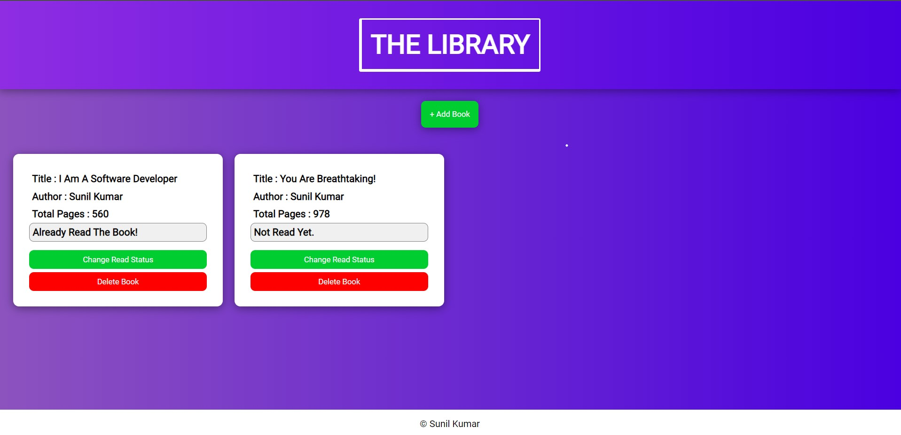
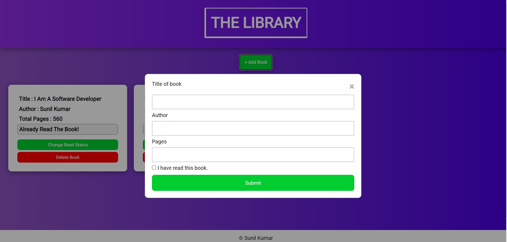
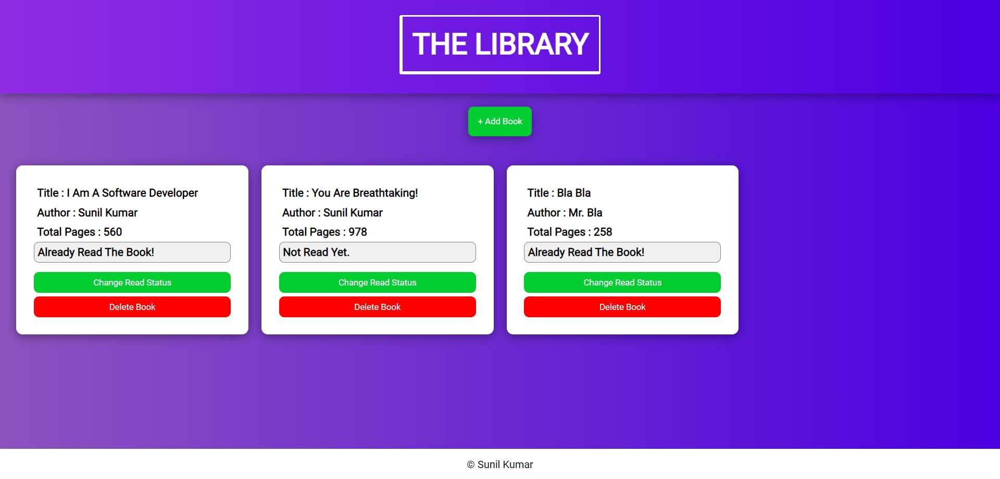
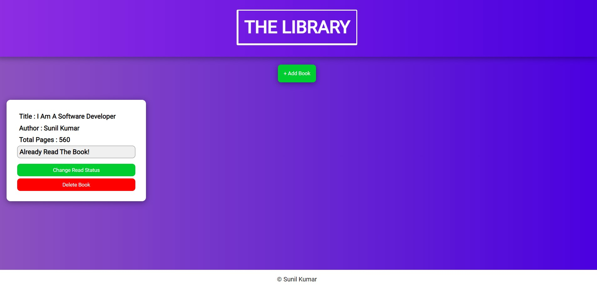

# The Library
This is book library created using HTML, CSS, Vanilla JavaScript. You can add books, delete books and change book read status.

## Learnings
* Work with grid and flexbox.
* Work with JavaScript objects and prototype.
* Dom manipulation using JavaScript.
* Modal Form creation.
* Learn about events.

## Screenshots

